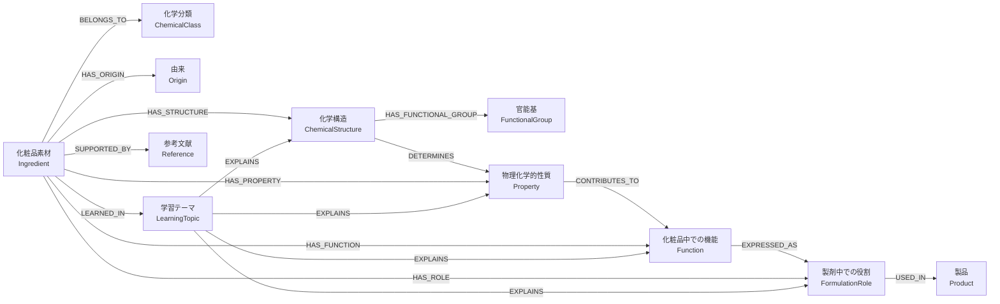
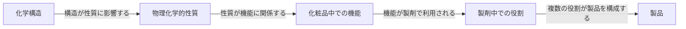
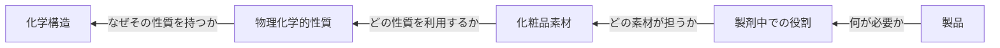
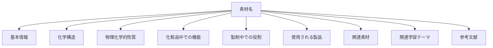
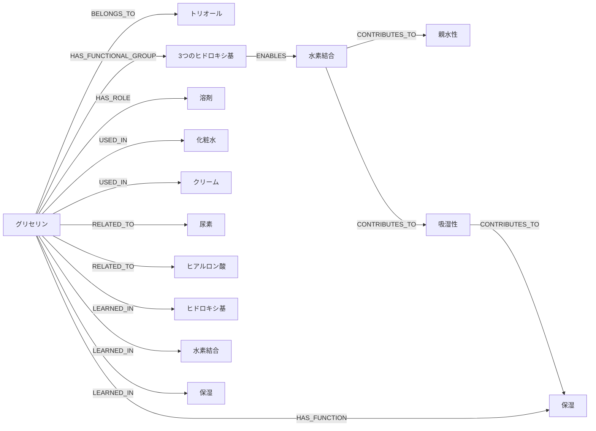
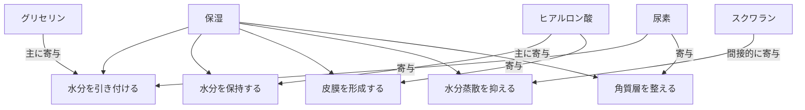
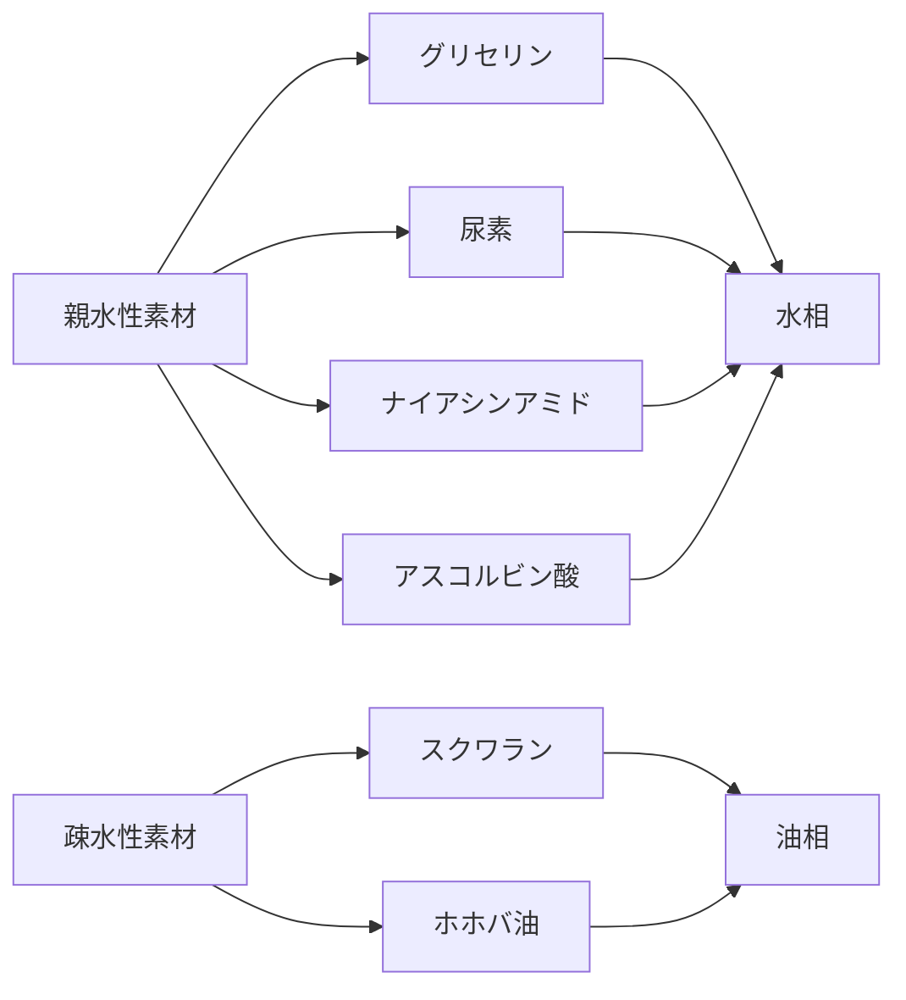
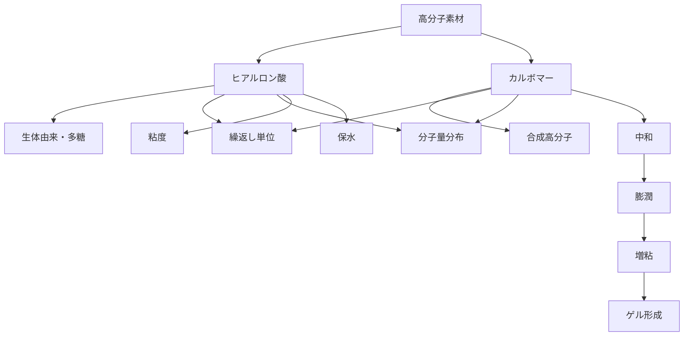
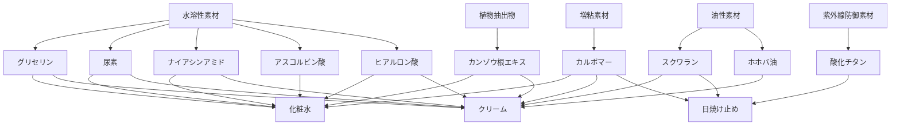
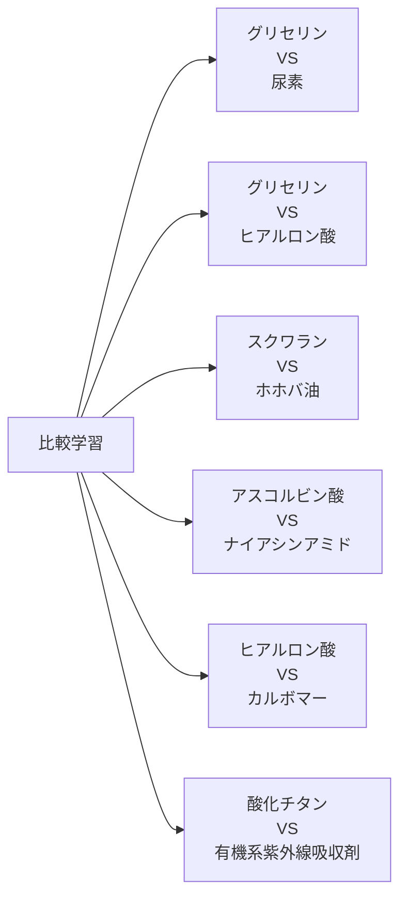

# 知識グラフ図

## 文書情報

* 文書バージョン：Ver.0.1
* 更新日：2026-07-21
* 対象プロジェクト：化粧品素材から化学を学ぼう
* 対応文書：`docs/04_知識グラフ.md`

---

# 1. 目的

本書は、化粧品素材、化学構造、物理化学的性質、機能、製剤中での役割、製品、学習テーマなどの関係を図として可視化するための文書である。

図は設計内容の確認、データモデルの検討、画面遷移の設計、および実装時の参照に使用する。

---

# 2. 基本知識グラフ



---

# 3. 基本学習経路

化学構造から製品までをたどる順方向の学習経路を示す。



学習者は、次の問いを順に考える。

```text
どのような構造を持つか
↓
その構造から、どのような性質が生じるか
↓
その性質が、化粧品中でどのような機能につながるか
↓
製剤中で、どのような役割を果たすか
↓
どのような製品に利用されるか
```

---

# 4. 逆方向学習経路

製品から化学構造へ遡る学習経路を示す。



学習者は、次の問いを逆方向に考える。

```text
この製品には何が必要か
↓
その役割を担う素材は何か
↓
その素材はどのような性質を持つか
↓
なぜその性質を持つのか
```

---

# 5. 素材詳細画面の知識構造

素材詳細画面で表示する情報の関係を示す。



---

# 6. グリセリンの知識グラフ例



---

# 7. 保湿を中心とした知識グラフ



この図では、保湿を単一の作用として扱わず、複数の機構に分けて表現する。

---

# 8. 親水性と疎水性の比較グラフ



---

# 9. 高分子素材の比較グラフ



---

# 10. 製品カテゴリーとの関係



---

# 11. 素材比較の関係



比較画面では、関係を次の3種類に分けて表示する。

```text
共通点
相違点
使い分け
```

---

# 12. リレーション種別

知識グラフで使用するリレーションを整理する。

## 12.1 構造に関するリレーション

| リレーション               | 意味       |
| -------------------- | -------- |
| HAS_STRUCTURE        | 化学構造を持つ  |
| HAS_FUNCTIONAL_GROUP | 官能基を持つ   |
| HAS_REPEAT_UNIT      | 繰返し単位を持つ |
| HAS_CRYSTAL_FORM     | 結晶型を持つ   |
| HAS_COMPONENT        | 構成成分を含む  |

---

## 12.2 分類に関するリレーション

| リレーション       | 意味            |
| ------------ | ------------- |
| BELONGS_TO   | 分類に属する        |
| HAS_ORIGIN   | 由来を持つ         |
| IS_TYPE_OF   | 上位概念の一種である    |
| DERIVED_FROM | 原料または物質から得られる |

---

## 12.3 性質に関するリレーション

| リレーション         | 意味           |
| -------------- | ------------ |
| HAS_PROPERTY   | 性質を持つ        |
| DETERMINES     | 構造などが性質を決める  |
| CONTRIBUTES_TO | ある性質や作用に寄与する |
| AFFECTED_BY    | 条件の影響を受ける    |

---

## 12.4 機能・製剤に関するリレーション

| リレーション       | 意味          |
| ------------ | ----------- |
| HAS_FUNCTION | 化粧品中での機能を持つ |
| HAS_ROLE     | 製剤中での役割を持つ  |
| USED_IN      | 製品に使用される    |
| STABILIZES   | 製剤などを安定化する  |
| THICKENS     | 粘度を高める      |
| FORMS_FILM   | 皮膜を形成する     |
| DISPERSES    | 粒子などを分散させる  |

---

## 12.5 学習に関するリレーション

| リレーション         | 意味         |
| -------------- | ---------- |
| LEARNED_IN     | 学習テーマに含まれる |
| EXPLAINS       | 概念や現象を説明する |
| RELATED_TO     | 一般的な関連がある  |
| SIMILAR_TO     | 類似している     |
| CONTRASTS_WITH | 対比して学べる    |
| COMPARED_WITH  | 比較対象である    |

---

## 12.6 根拠に関するリレーション

| リレーション       | 意味            |
| ------------ | ------------- |
| SUPPORTED_BY | 文献などによって支持される |
| DESCRIBED_IN | 資料に記載されている    |
| VERIFIED_BY  | 確認資料がある       |

---

# 13. グラフ実装時の原則

知識グラフをデータとして実装する際は、次の原則に従う。

1. ノードは一意のIDを持つ。
2. 表示名称をリレーションの識別子に使用しない。
3. リレーションの向きを明確にする。
4. 曖昧な関係には、無理に強い意味を付けない。
5. `RELATED_TO` の使用を最小限にする。
6. 可能な場合は、より具体的なリレーションを使用する。
7. 比較関係と因果関係を区別する。
8. 素材の機能と製剤中での役割を区別する。
9. すべての主張に文献を直接付ける必要はないが、重要な科学的説明は参考文献へたどれるようにする。
10. 将来のグラフデータベース移行を考慮する。

---

# 14. JSONでの表現例

Ver.0.1では、知識グラフ専用データベースを使用せず、JSON内のID参照によって関係を表現する。

```json
{
  "id": "ING0001",
  "slug": "glycerin",
  "nameJa": "グリセリン",
  "structureId": "STR0001",
  "chemicalClassIds": [
    "CLASS0001",
    "CLASS0002"
  ],
  "propertyIds": [
    "PROP0001",
    "PROP0002",
    "PROP0003"
  ],
  "functionIds": [
    "FUNC0001"
  ],
  "formulationRoleIds": [
    "ROLE0001"
  ],
  "productIds": [
    "PROD0001",
    "PROD0002"
  ],
  "relatedIngredientIds": [
    "ING0002",
    "ING0006"
  ],
  "learningTopicIds": [
    "TOP0001",
    "TOP0002",
    "TOP0003"
  ],
  "referenceIds": [
    "REF0001",
    "REF0002"
  ]
}
```

---

# 15. エッジ形式での表現例

将来は、関係を独立したエッジデータとして管理できる。

```json
{
  "id": "EDGE0001",
  "sourceId": "ING0001",
  "relation": "HAS_PROPERTY",
  "targetId": "PROP0001",
  "description": "グリセリンは水と相互作用しやすい",
  "referenceIds": [
    "REF0001"
  ]
}
```

複数の関係を配列として管理する場合の例：

```json
[
  {
    "sourceId": "ING0001",
    "relation": "HAS_FUNCTIONAL_GROUP",
    "targetId": "FG0001"
  },
  {
    "sourceId": "FG0001",
    "relation": "CONTRIBUTES_TO",
    "targetId": "PROP0001"
  },
  {
    "sourceId": "PROP0001",
    "relation": "CONTRIBUTES_TO",
    "targetId": "FUNC0001"
  }
]
```

---

# 16. 将来のグラフデータベース表現

将来、Neo4jなどを採用した場合は、次のようなノードとエッジで表現できる。

```text
(:Ingredient)-[:HAS_STRUCTURE]->(:ChemicalStructure)

(:ChemicalStructure)-[:HAS_FUNCTIONAL_GROUP]->(:FunctionalGroup)

(:FunctionalGroup)-[:CONTRIBUTES_TO]->(:Property)

(:Ingredient)-[:HAS_FUNCTION]->(:Function)

(:Ingredient)-[:HAS_ROLE]->(:FormulationRole)

(:Ingredient)-[:USED_IN]->(:Product)

(:Ingredient)-[:LEARNED_IN]->(:LearningTopic)

(:Ingredient)-[:SUPPORTED_BY]->(:Reference)
```

ただし、Ver.1.0まではJSONとTypeScriptによる管理を基本とする。

---

# 17. Mermaid図の表示について

Mermaidに対応しているMarkdownビューアでは、コードブロックが図として表示される。

GitHub上では、対応するMermaid構文であれば図として表示できる。

表示できない環境では、コードブロック内の関係をテキストとして確認する。

---

# 18. 更新方針

次の場合に本書を更新する。

* 新しいノード種別を追加したとき
* 新しいリレーションを追加したとき
* データモデルを変更したとき
* 学習経路を変更したとき
* 初期素材を追加または削除したとき
* 製品カテゴリーを追加したとき
* グラフデータベースへ移行したとき
* 画面上の知識グラフ表示方法を変更したとき

重要な変更は、`docs/08_変更履歴.md` にも記録する。
