# 画面遷移図

## 文書情報

* 文書バージョン：Ver.0.1
* 更新日：2026-07-21
* 対象プロジェクト：化粧品素材から化学を学ぼう
* 対応文書：`docs/05_画面設計.md`

---

# 1. 目的

本書は、本システムにおける主要画面と画面間の遷移を可視化するための文書である。

利用者がどの入口から学習を開始し、どのように素材、製品、学習テーマ、比較画面を移動するかを整理する。

また、実装時のルーティング設計、ナビゲーション設計、パンくずリスト設計の基礎資料として使用する。

---

# 2. 全体画面遷移

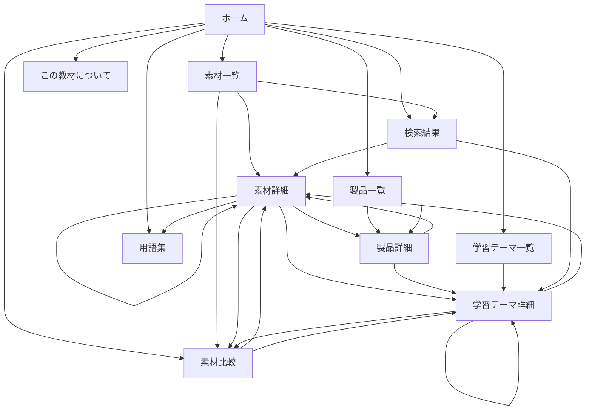

---

# 3. グローバルナビゲーション

すべての主要画面から、次の画面へ移動できるようにする。

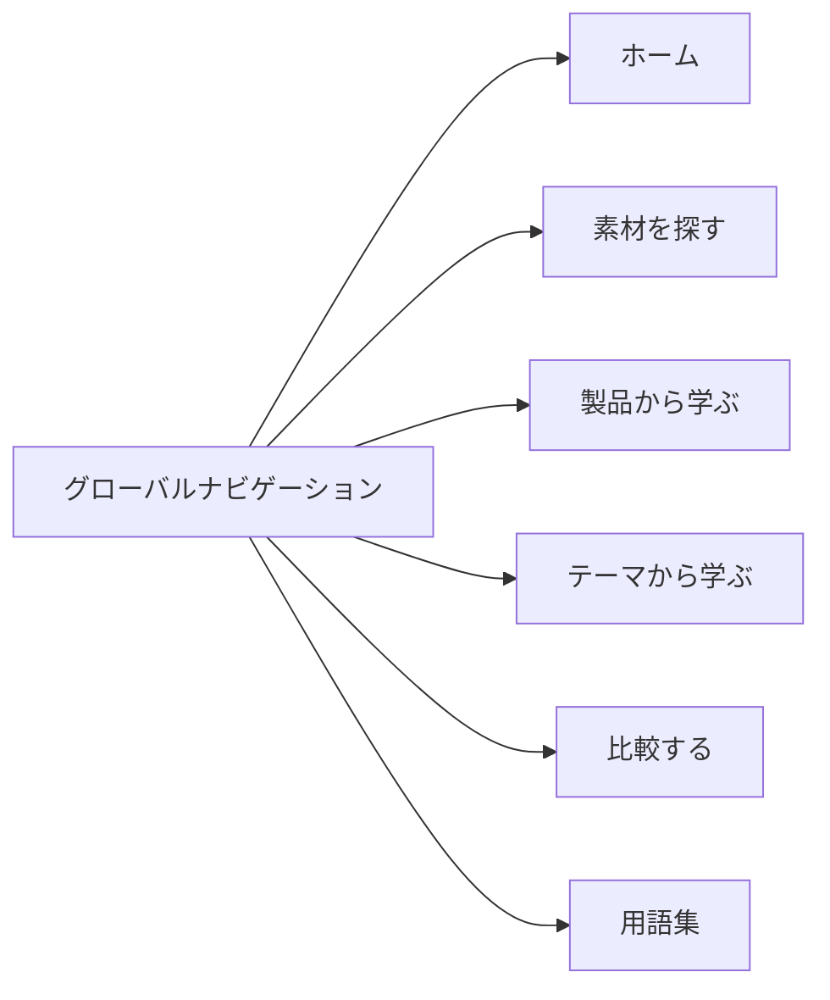

初期公開版では、グローバルナビゲーションの項目を増やしすぎない。

推奨表示：

```text
ホーム
素材を探す
製品から学ぶ
テーマから学ぶ
比較する
```

「用語集」と「この教材について」は、フッターまたは補助メニューへ配置してもよい。

---

# 4. ホーム画面からの学習開始

ホーム画面では、利用者が学習方法を選択できるようにする。

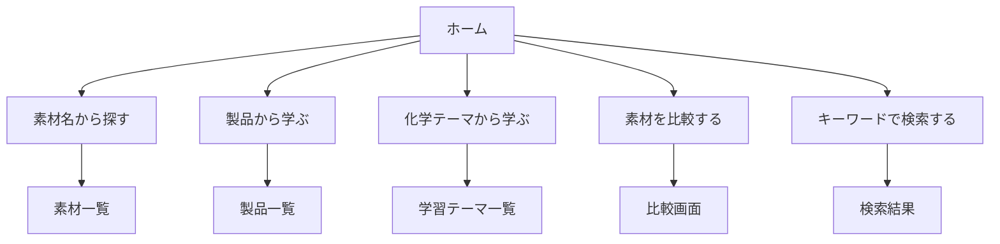

ホーム画面では、利用者が「どこから始めればよいか」を迷わないことを優先する。

---

# 5. 素材から学ぶ経路

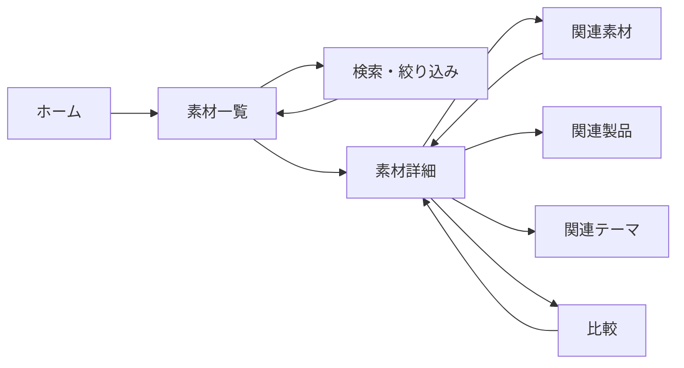

代表的な利用例：

```text
ホーム
↓
素材を探す
↓
保湿で絞り込む
↓
グリセリンを選ぶ
↓
構造と保湿機能を学ぶ
↓
尿素と比較する
```

---

# 6. 製品から学ぶ経路

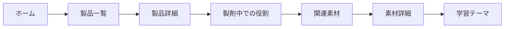

代表的な利用例：

```text
ホーム
↓
製品から学ぶ
↓
クリームを選ぶ
↓
水相・油相・増粘の役割を確認する
↓
スクワランを選ぶ
↓
疎水性とエモリエントを学ぶ
```

---

# 7. 学習テーマから学ぶ経路

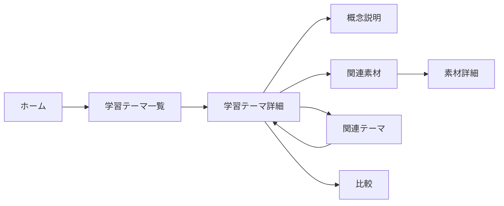

代表的な利用例：

```text
ホーム
↓
テーマから学ぶ
↓
水素結合を選ぶ
↓
水との相互作用を学ぶ
↓
グリセリンと尿素を見る
↓
両者を比較する
```

---

# 8. 比較学習の経路

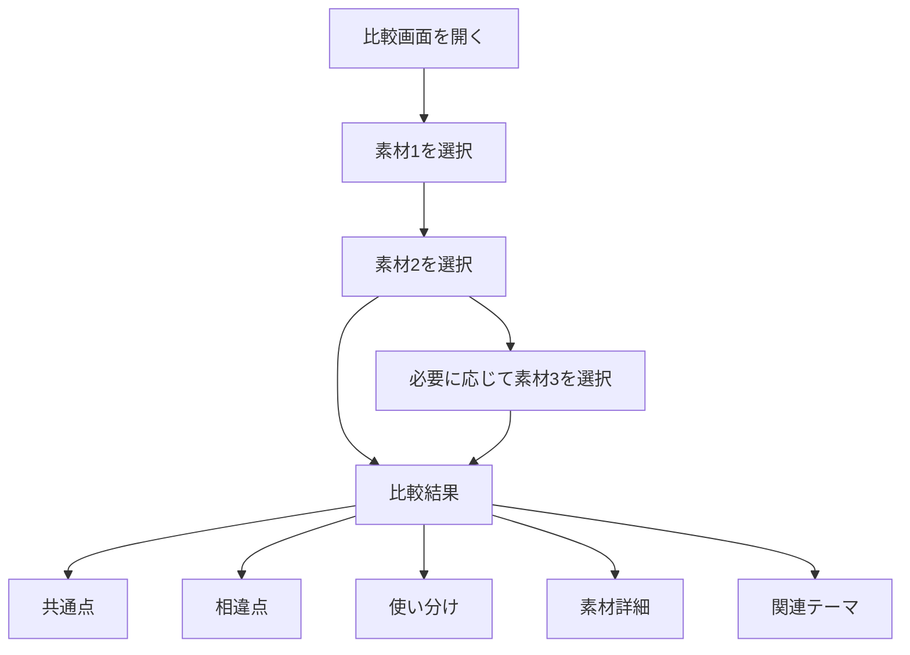

比較画面では、利用者が最低2素材を選択した時点で比較結果を表示できるようにする。

比較対象は最大3素材を基本とする。

---

# 9. 検索経路

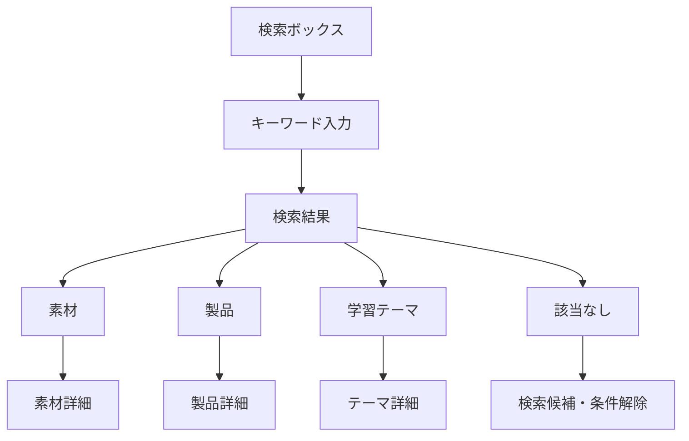

初期実装では、検索対象を次の順に拡張する。

1. 素材名
2. 英語名
3. INCI名
4. 別名
5. 機能
6. 化学分類
7. 学習テーマ
8. 製品カテゴリー

---

# 10. 素材一覧画面の内部遷移

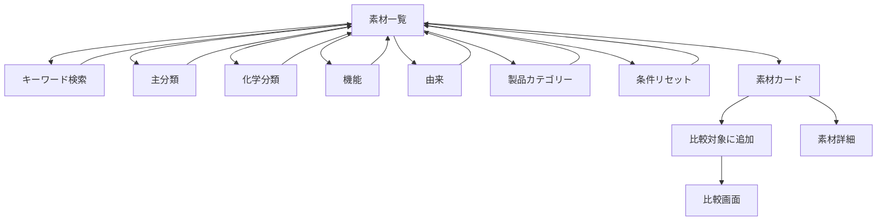

---

# 11. 素材詳細画面の内部遷移

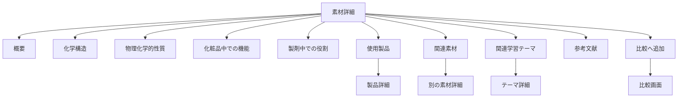

素材詳細画面は、一つの縦長ページを基本とする。

ページ内リンクまたはセクションナビゲーションを設置し、目的の情報へ移動しやすくする。

---

# 12. 製品詳細画面の内部遷移

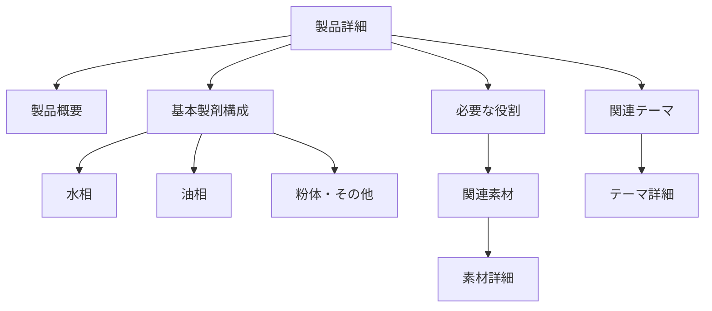

製品画面では、実際の商品処方を断定的に示すのではなく、製品カテゴリーの基本的な構成を学習用に示す。

---

# 13. 学習テーマ詳細画面の内部遷移

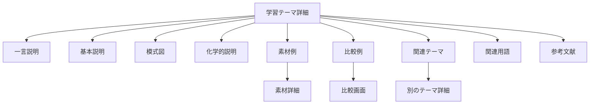

---

# 14. パンくずリスト

主要画面では、現在位置を示すパンくずリストを表示する。

例：

## 素材詳細

```text
ホーム
＞
素材を探す
＞
グリセリン
```

## 製品詳細

```text
ホーム
＞
製品から学ぶ
＞
クリーム
```

## 学習テーマ詳細

```text
ホーム
＞
テーマから学ぶ
＞
水素結合
```

## 比較画面

```text
ホーム
＞
比較する
＞
グリセリンと尿素
```

パンくずリストの各項目は、原則として上位画面へのリンクとする。

---

# 15. URL設計

画面遷移とURLを対応させる。

| 画面      | URL例                       |
| ------- | -------------------------- |
| ホーム     | `/`                        |
| 素材一覧    | `/ingredients`             |
| 素材詳細    | `/ingredients/glycerin`    |
| 製品一覧    | `/products`                |
| 製品詳細    | `/products/cream`          |
| 学習テーマ一覧 | `/topics`                  |
| 学習テーマ詳細 | `/topics/hydrogen-bonding` |
| 比較      | `/compare`                 |
| 検索      | `/search?q=glycerin`       |
| 用語集     | `/glossary`                |
| 教材について  | `/about`                   |

URLでは、原則として英小文字とハイフンを使用する。

---

# 16. 直接アクセス

利用者は、ホーム画面を経由せず、URLから素材詳細や学習テーマ詳細へ直接アクセスできるものとする。

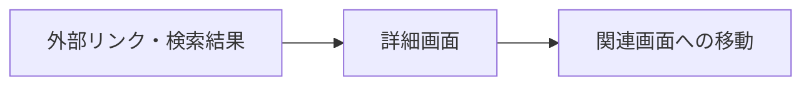

直接アクセス時にも、次の情報を表示する。

* ページタイトル
* パンくずリスト
* グローバルナビゲーション
* 関連素材
* 関連テーマ
* ホームへのリンク

---

# 17. 戻る操作

利用者が画面遷移後に元の条件へ戻れるようにする。

例：

```text
素材一覧
↓
「保湿」で絞り込み
↓
グリセリン詳細
↓
一覧へ戻る
```

この場合、可能な限り次の状態を維持する。

* 検索キーワード
* 絞り込み条件
* 並び順
* スクロール位置
* 比較対象への選択状態

初期版では実装難易度を考慮し、少なくともURLクエリによって検索条件を保持する。

例：

```text
/ingredients?function=moisturizing
```

---

# 18. スマートフォンでの画面遷移

スマートフォンでは、グローバルナビゲーションを折りたたみ式にできる。

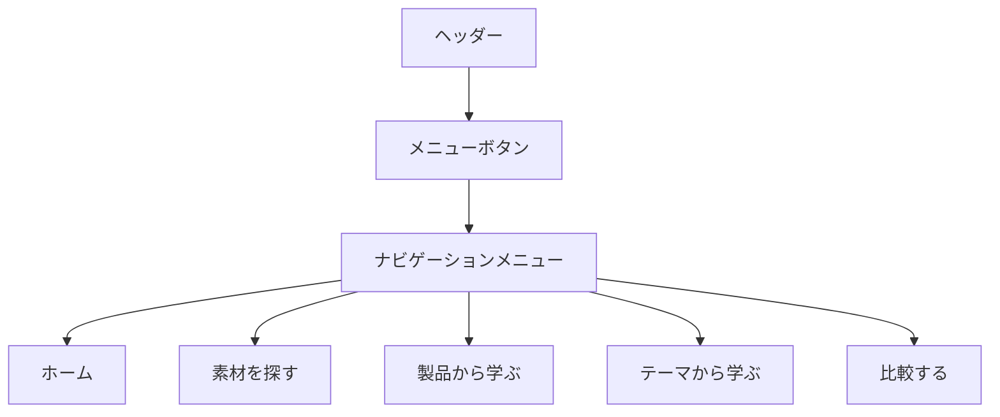

スマートフォンでは、画面下部の固定ナビゲーションも将来候補とするが、Ver.1.0では必須としない。

---

# 19. エラー時の遷移

## 19.1 存在しないURL

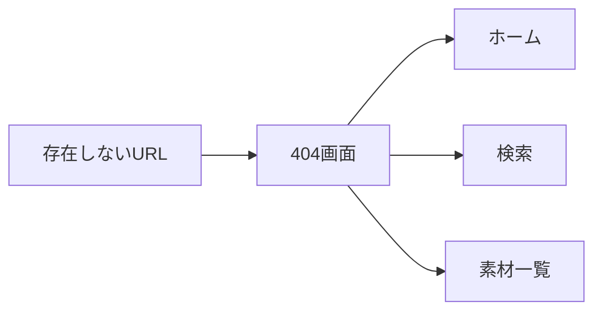

404画面では、エラーコードだけでなく、利用者が次に進めるリンクを表示する。

---

## 19.2 素材データが見つからない場合

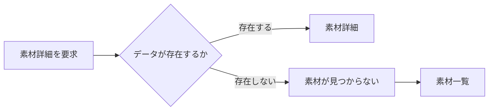

---

## 19.3 検索結果が0件の場合

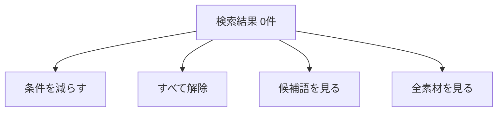

---

# 20. 初回利用者の推奨経路

初めて利用する人には、次の経路を推奨する。

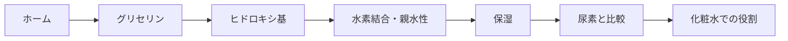

この経路により、システムの基本概念である次の流れを体験できる。

```text
構造
↓
性質
↓
機能
↓
比較
↓
製品
```

---

# 21. 授業での利用経路

教員が授業で利用する場合の例を示す。

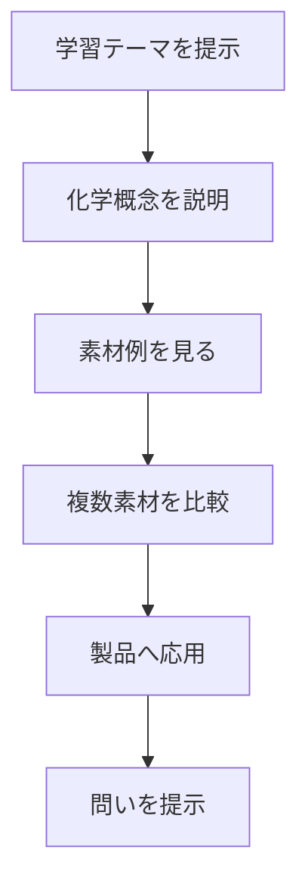

例：

```text
水素結合
↓
グリセリンと尿素
↓
構造の違いを比較
↓
保湿機構を比較
↓
化粧水やクリームでの役割を考える
```

---

# 22. 自主学習での利用経路

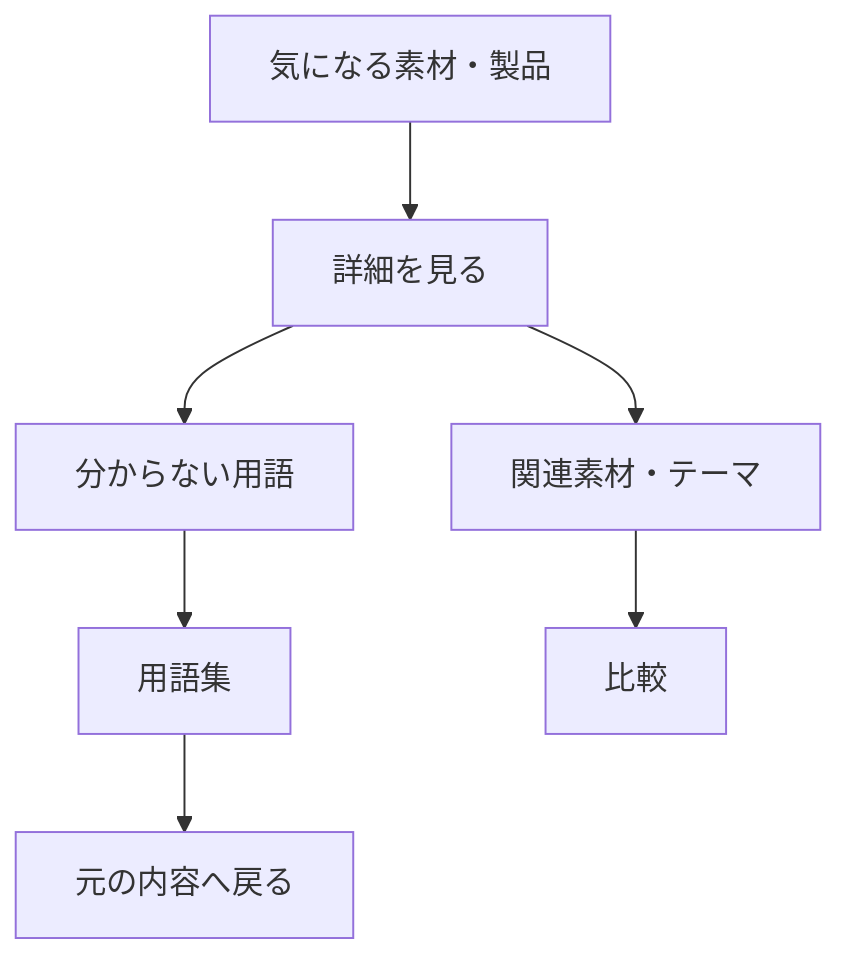

---

# 23. Ver.1.0で実装する遷移

Ver.1.0では、少なくとも次の遷移を実装する。

* ホームから素材一覧
* ホームから製品一覧
* ホームから学習テーマ一覧
* ホームから比較画面
* 素材一覧から素材詳細
* 素材詳細から関連素材
* 素材詳細から製品詳細
* 素材詳細から学習テーマ詳細
* 素材詳細から比較画面
* 製品一覧から製品詳細
* 製品詳細から素材詳細
* 学習テーマ一覧からテーマ詳細
* テーマ詳細から素材詳細
* テーマ詳細から比較画面
* 検索結果から各詳細画面
* 主要画面からホーム

---

# 24. Ver.1.1以降の追加候補

将来、次の画面と遷移を追加候補とする。

* クイズ一覧
* クイズ詳細
* 学習履歴
* お気に入り
* 理解度確認
* ログイン
* マイページ
* 教員用画面
* 授業用コース
* 学習順序の推奨
* AI質問画面
* 処方シミュレーション
* 構造式から素材を考える問題
* 素材から製品構成を考える問題

将来の例：

```mermaid
flowchart LR
    DETAIL[素材詳細]
    QUIZ[関連クイズ]
    RESULT[回答結果]
    HISTORY[学習履歴]
    RECOMMEND[次の学習候補]

    DETAIL --> QUIZ
    QUIZ --> RESULT
    RESULT --> HISTORY
    RESULT --> RECOMMEND
```

---

# 25. 画面遷移設計の原則

1. 主要画面へ3操作以内で到達できるようにする。
2. 行き止まりの画面を作らない。
3. すべての詳細画面に関連リンクを設ける。
4. 検索と一覧の役割を重複させすぎない。
5. URLから直接アクセスできるようにする。
6. 戻る操作で利用者の条件を失わせない。
7. 現在位置をパンくずリストで示す。
8. スマートフォンでも主要遷移を維持する。
9. エラー時に次の行動を提示する。
10. 学習経路と単なるサイト閲覧を一致させる。

---

# 26. 更新方針

次の場合に本書を更新する。

* 新しい画面を追加したとき
* URL構造を変更したとき
* グローバルナビゲーションを変更したとき
* 検索対象を追加したとき
* 比較機能の仕様を変更したとき
* ログインや学習履歴を導入したとき
* スマートフォンのナビゲーションを変更したとき
* 教員用機能を追加したとき

重要な変更は、`docs/08_変更履歴.md` にも記録する。
