# システム構成図

## 文書情報

* 文書バージョン：Ver.0.1
* 更新日：2026-07-21
* 対象プロジェクト：化粧品素材から化学を学ぼう
* 対応文書：`docs/06_技術設計.md`

---

# 1. 目的

本書は、本システムの技術構成、主要なディレクトリ、データの流れ、画面生成の仕組み、および将来の拡張方針を可視化するための文書である。

Ver.1.0までは、Next.js、React、TypeScript、Tailwind CSS、JSONを中心とした比較的単純な構成を採用する。

初期段階では実装を複雑にしすぎず、素材データの正確性、教材としての分かりやすさ、保守性を優先する。

---

# 2. システム全体構成

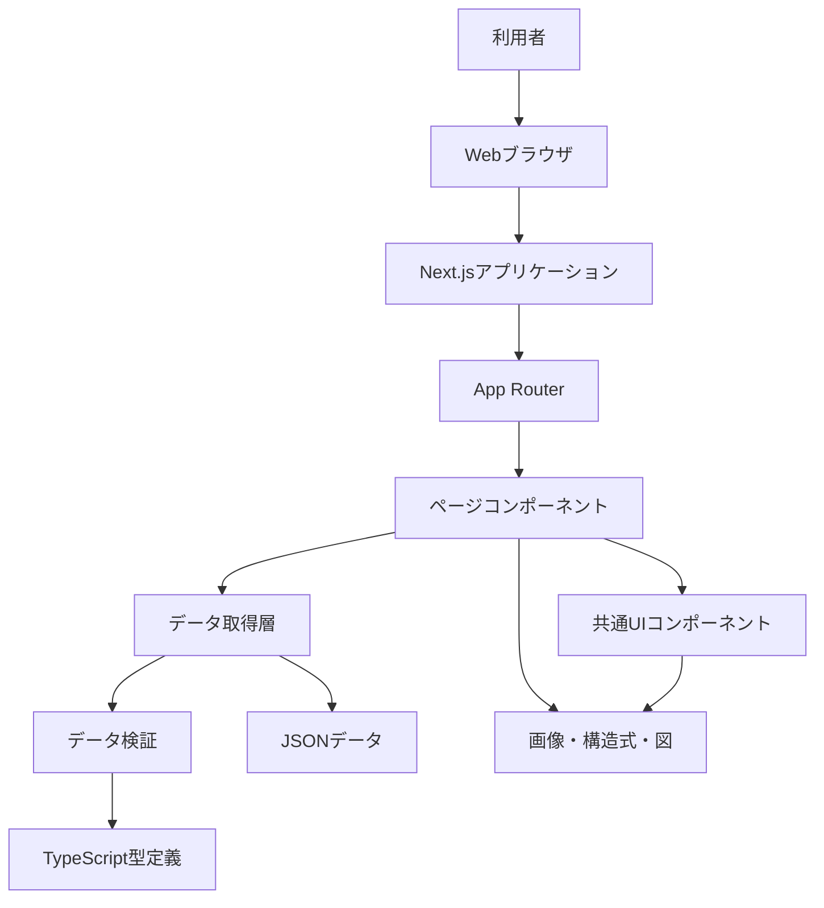

---

# 3. 基本技術構成

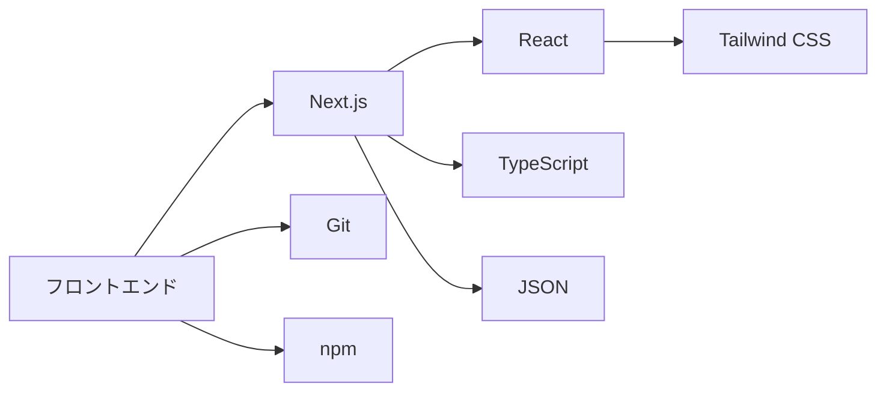

採用技術：

| 分類        | 技術           |
| --------- | ------------ |
| フレームワーク   | Next.js      |
| UI構築      | React        |
| プログラミング言語 | TypeScript   |
| スタイル      | Tailwind CSS |
| 初期データ保存   | JSON         |
| パッケージ管理   | npm          |
| バージョン管理   | Git          |
| 文書管理      | Markdown     |
| 図表        | Mermaid      |

---

# 4. 初期システム構成

Ver.1.0までの構成を示す。

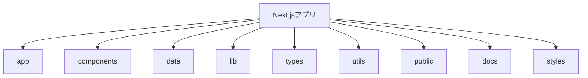

推奨ディレクトリ構成：

```text
cosmetic-chemistry-learning/
├── app/
├── components/
├── data/
├── docs/
├── lib/
├── public/
├── styles/
├── types/
├── utils/
├── .gitignore
├── package.json
├── tsconfig.json
└── README.md
```

---

# 5. `app` ディレクトリ構成

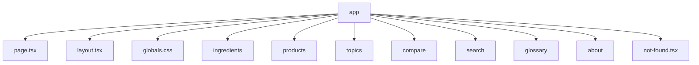

推奨構成：

```text
app/
├── layout.tsx
├── page.tsx
├── globals.css
├── not-found.tsx
├── ingredients/
│   ├── page.tsx
│   └── [slug]/
│       └── page.tsx
├── products/
│   ├── page.tsx
│   └── [slug]/
│       └── page.tsx
├── topics/
│   ├── page.tsx
│   └── [slug]/
│       └── page.tsx
├── compare/
│   └── page.tsx
├── search/
│   └── page.tsx
├── glossary/
│   └── page.tsx
└── about/
    └── page.tsx
```

---

# 6. 画面ルーティング

```mermaid
flowchart LR
    URL[URL]
    ROUTER[Next.js App Router]

    HOME[ホーム]
    ING_LIST[素材一覧]
    ING_DETAIL[素材詳細]
    PROD_LIST[製品一覧]
    PROD_DETAIL[製品詳細]
    TOPIC_LIST[テーマ一覧]
    TOPIC_DETAIL[テーマ詳細]
    COMPARE[比較]
    SEARCH[検索]

    URL --> ROUTER

    ROUTER -->|/| HOME
    ROUTER -->|/ingredients| ING_LIST
    ROUTER -->|/ingredients/[slug]| ING_DETAIL
    ROUTER -->|/products| PROD_LIST
    ROUTER -->|/products/[slug]| PROD_DETAIL
    ROUTER -->|/topics| TOPIC_LIST
    ROUTER -->|/topics/[slug]| TOPIC_DETAIL
    ROUTER -->|/compare| COMPARE
    ROUTER -->|/search| SEARCH
```

---

# 7. コンポーネント構成

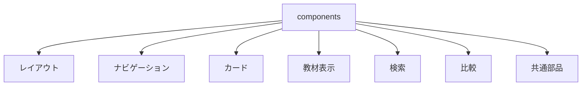

推奨構成：

```text
components/
├── layout/
│   ├── Header.tsx
│   ├── Footer.tsx
│   ├── MainNavigation.tsx
│   └── PageContainer.tsx
├── navigation/
│   ├── Breadcrumb.tsx
│   ├── SectionNavigation.tsx
│   └── MobileMenu.tsx
├── cards/
│   ├── IngredientCard.tsx
│   ├── ProductCard.tsx
│   ├── TopicCard.tsx
│   ├── PropertyCard.tsx
│   └── FunctionCard.tsx
├── ingredient/
│   ├── IngredientHeader.tsx
│   ├── StructureSection.tsx
│   ├── PropertySection.tsx
│   ├── FunctionSection.tsx
│   ├── FormulationRoleSection.tsx
│   ├── RelatedIngredients.tsx
│   └── ReferenceList.tsx
├── search/
│   ├── SearchBox.tsx
│   ├── FilterPanel.tsx
│   └── SearchResultList.tsx
├── compare/
│   ├── CompareSelector.tsx
│   ├── CompareTable.tsx
│   └── DifferenceSummary.tsx
└── common/
    ├── Badge.tsx
    ├── EmptyState.tsx
    ├── ErrorMessage.tsx
    └── ExternalLink.tsx
```

---

# 8. コンポーネント再利用

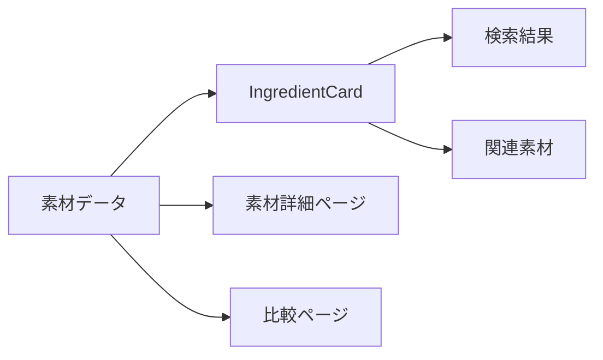

同じ素材情報を複数画面で表示する場合でも、表示ロジックを重複させず、共通コンポーネントを使用する。

---

# 9. データディレクトリ構成

初期段階では、素材ごとに関連データと画像をまとめる構成を推奨する。

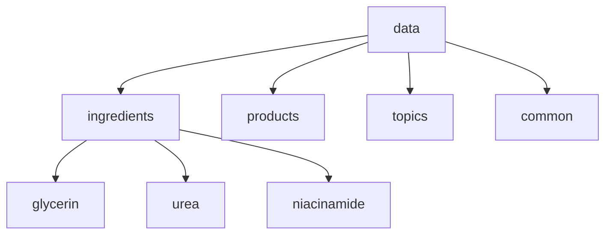

推奨構成：

```text
data/
├── ingredients/
│   ├── glycerin/
│   │   ├── ingredient.json
│   │   ├── references.json
│   │   └── relations.json
│   ├── urea/
│   │   ├── ingredient.json
│   │   ├── references.json
│   │   └── relations.json
│   └── ...
├── products/
│   ├── lotion.json
│   ├── cream.json
│   └── sunscreen.json
├── topics/
│   ├── hydrogen-bonding.json
│   ├── moisturizing.json
│   └── polymers.json
└── common/
    ├── chemical-classes.json
    ├── functions.json
    ├── formulation-roles.json
    ├── origins.json
    └── glossary.json
```

---

# 10. 画像・構造式の管理

画像ファイルは、ブラウザから配信するため `public` に配置する。

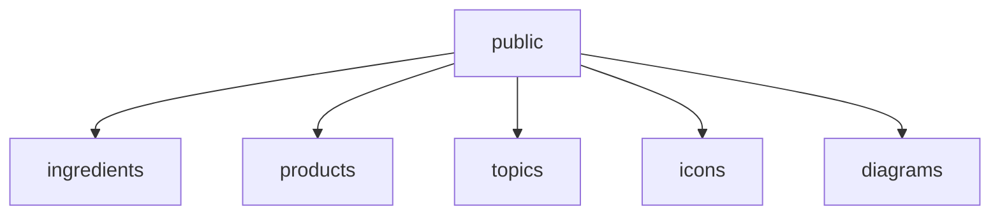

推奨構成：

```text
public/
├── ingredients/
│   ├── glycerin/
│   │   ├── structure.svg
│   │   ├── thumbnail.webp
│   │   └── illustration.webp
│   ├── urea/
│   │   └── structure.svg
│   └── ...
├── products/
│   ├── lotion.webp
│   ├── cream.webp
│   └── sunscreen.webp
├── topics/
│   ├── hydrogen-bonding.svg
│   └── emulsion.svg
├── icons/
└── diagrams/
```

JSON内では、公開パスを記録する。

```json
{
  "structureImage": "/ingredients/glycerin/structure.svg",
  "thumbnailImage": "/ingredients/glycerin/thumbnail.webp"
}
```

---

# 11. データ取得層

画面からJSONを直接読み込む処理を各ページへ分散させず、`lib` にまとめる。

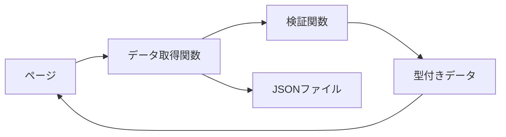

推奨構成：

```text
lib/
├── ingredients.ts
├── products.ts
├── topics.ts
├── search.ts
├── compare.ts
├── references.ts
└── validation.ts
```

関数例：

```text
getAllIngredients()
getIngredientBySlug()
getRelatedIngredients()
getAllProducts()
getProductBySlug()
getAllTopics()
getTopicBySlug()
searchContent()
compareIngredients()
```

---

# 12. 素材詳細ページのデータフロー

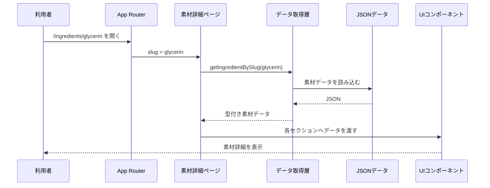

---

# 13. 検索機能のデータフロー

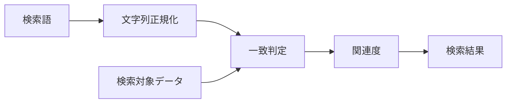

初期検索対象：

* 日本語名
* 英語名
* INCI名
* 別名
* 主分類
* 化学分類
* 機能
* 製剤中での役割
* 学習テーマ

初期版では、外部検索エンジンを使用せず、アプリ内データを対象とした検索とする。

---

# 14. 比較機能のデータフロー

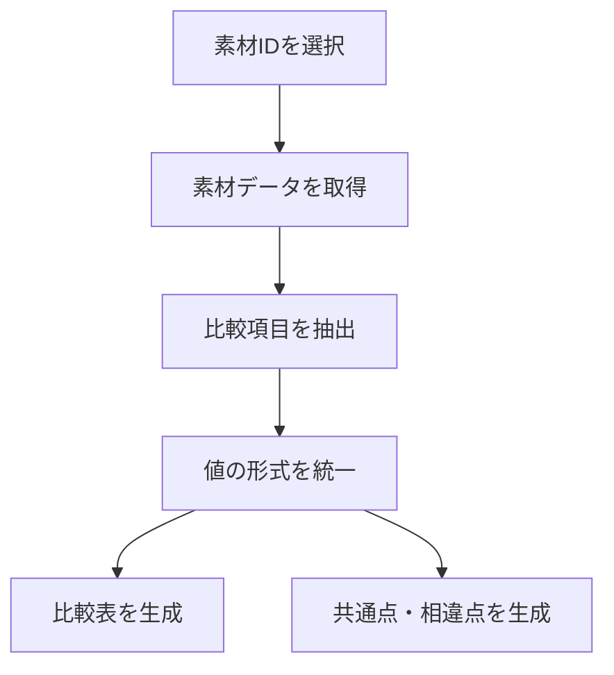

比較項目例：

* 主分類
* 化学分類
* 分子式または代表構造
* 分子量
* 官能基
* 親水性・疎水性
* 主な物性
* 化粧品中での機能
* 製剤中での役割
* 関連製品
* 安定性
* 学習テーマ

---

# 15. TypeScript型定義

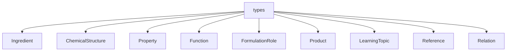

推奨構成：

```text
types/
├── ingredient.ts
├── chemical-structure.ts
├── property.ts
├── function.ts
├── formulation-role.ts
├── product.ts
├── learning-topic.ts
├── reference.ts
├── relation.ts
└── index.ts
```

---

# 16. 型定義例

```ts
export type IngredientCategory =
  | "single-compound"
  | "polymer"
  | "mixture"
  | "extract"
  | "inorganic";

export interface Ingredient {
  id: string;
  slug: string;
  nameJa: string;
  nameEn: string;
  inciName: string;
  displayNameJa?: string;
  aliases: string[];
  primaryCategory: IngredientCategory;
  chemicalClassIds: string[];
  summary: string;
  formula?: string;
  molecularWeight?: number | string;
  structureImage?: string;
  propertyIds: string[];
  functionIds: string[];
  formulationRoleIds: string[];
  productIds: string[];
  relatedIngredientIds: string[];
  learningTopicIds: string[];
  referenceIds: string[];
  verificationStatus: "draft" | "reviewed" | "verified";
}
```

高分子、混合物、抽出物では、`formula` や `molecularWeight` が単純な数値にならない場合があるため、任意項目または文字列を許容する。

---

# 17. データ検証構成

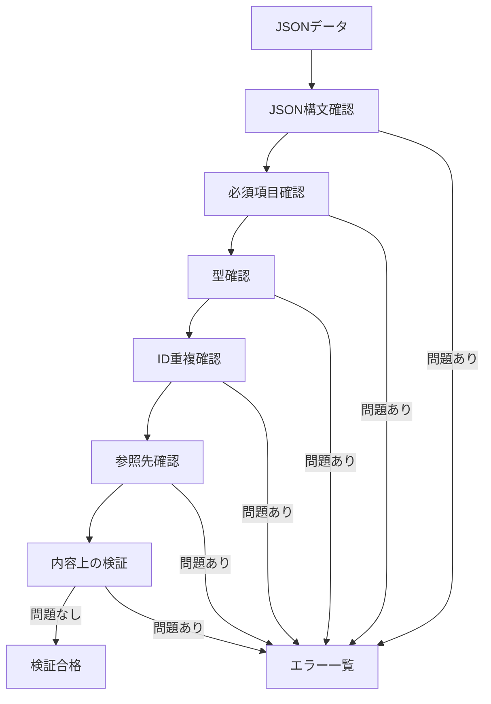

検証内容：

* JSONとして読み込めるか
* 必須項目が存在するか
* IDが重複していないか
* スラッグが重複していないか
* 参照先IDが存在するか
* 画像パスが存在するか
* 主分類が定義済みの値か
* 単一化合物に必要な項目があるか
* 混合物へ不適切な分子式が付いていないか
* 高分子の分子量表現が適切か
* 参考文献が登録されているか

---

# 18. データ確認ステータス

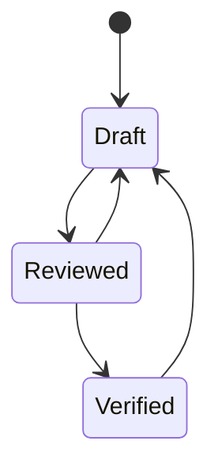

ステータス：

| 値          | 意味           |
| ---------- | ------------ |
| `draft`    | 作成中          |
| `reviewed` | 内容確認済み       |
| `verified` | 根拠資料を含めて確認済み |

化学的な説明に修正が入った場合は、必要に応じて `verified` から `draft` に戻す。

---

# 19. サーバーコンポーネントとクライアントコンポーネント

Next.jsでは、可能な限りサーバーコンポーネントを使用する。

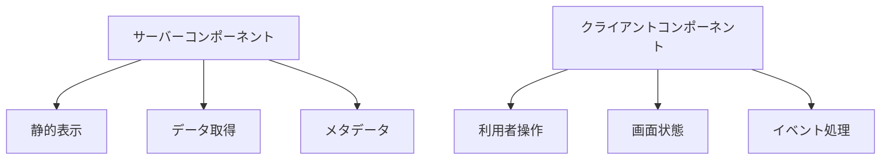

サーバーコンポーネント向き：

* 素材一覧の初期表示
* 素材詳細
* 製品詳細
* 学習テーマ詳細
* 参考文献一覧
* メタデータ生成

クライアントコンポーネント向き：

* 検索入力
* 絞り込み
* 比較対象の選択
* メニュー開閉
* タブ切替
* ページ内ナビゲーション
* お気に入り機能

---

# 20. 静的生成

初期素材数が少ないため、素材詳細、製品詳細、テーマ詳細は静的生成を基本とする。

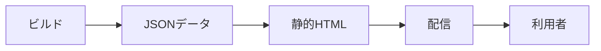

利点：

* 表示が速い
* サーバー負荷が小さい
* 公開構成が単純
* SEOに対応しやすい
* JSONの不整合をビルド時に検出しやすい

---

# 21. ビルド処理

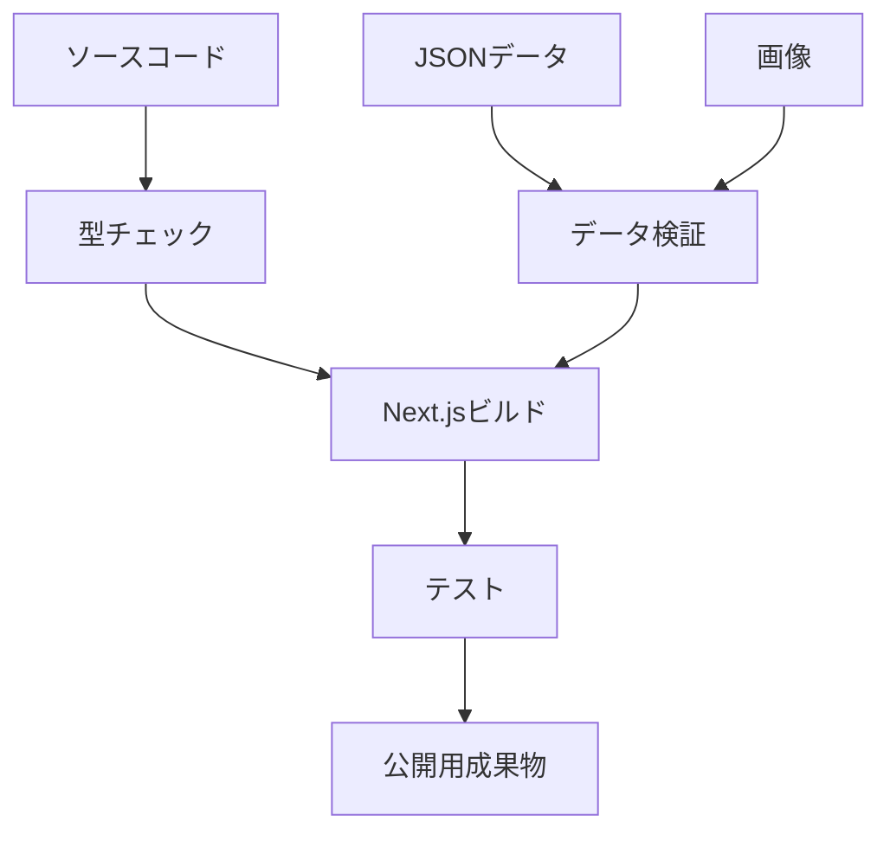

公開前に最低限実行するコマンド例：

```bash
npm run lint
npm run typecheck
npm run validate-data
npm run test
npm run build
```

実際のスクリプト名は、実装時に `package.json` で定義する。

---

# 22. 開発時の処理

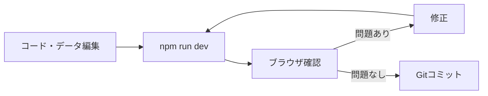

---

# 23. Git運用構成

```mermaid
gitGraph
    commit id: "Initial repository"
    commit id: "Add Ver.0.1 design documents"
    branch feature/environment
    checkout feature/environment
    commit id: "Create Next.js project"
    commit id: "Add base layout"
    checkout main
    merge feature/environment
    commit id: "Release v0.2.0"
```

ブランチ例：

```text
main
feature/environment
feature/data-model
feature/ingredient-list
feature/ingredient-detail
feature/search
feature/compare
bugfix/ingredient-data
release/v1.0.0
```

---

# 24. 設計書と実装の関係

```mermaid
flowchart TB
    DOCS[設計書]
    ISSUE[実装課題]
    BRANCH[Gitブランチ]
    CODE[実装]
    TEST[検証]
    CHANGELOG[変更履歴]
    COMMIT[コミット]
    TAG[タグ]

    DOCS --> ISSUE
    ISSUE --> BRANCH
    BRANCH --> CODE
    CODE --> TEST
    TEST --> CHANGELOG
    CHANGELOG --> COMMIT
    COMMIT --> TAG
```

標準手順：

```text
設計書を確認・更新
↓
完成条件を決める
↓
ブランチを作成
↓
実装する
↓
テストする
↓
設計との差を確認する
↓
変更履歴を更新する
↓
コミットする
↓
必要に応じてタグを付ける
```

---

# 25. 初期公開構成

```mermaid
flowchart LR
    REPO[Gitリポジトリ]
    BUILD[自動または手動ビルド]
    HOST[ホスティングサービス]
    WEB[公開Webサイト]

    REPO --> BUILD
    BUILD --> HOST
    HOST --> WEB
```

ホスティング先は実装段階で決定する。

候補：

* Vercel
* Netlify
* GitHub Pages
* 大学管理サーバー

Next.jsの機能を十分に利用する場合は、VercelなどのNext.js対応環境が有力候補となる。

---

# 26. Ver.1.0までの非採用機能

初期実装では、次の機能を必須としない。

* 利用者ログイン
* 管理画面
* 外部データベース
* APIサーバー
* 学習履歴保存
* お気に入り保存
* AIチャット
* コメント投稿
* 利用者による素材追加
* 複雑な権限管理
* リアルタイム通信
* 課金機能

これらを早期に導入すると、素材データと教材内容の整備が遅れる可能性があるため、初期公開後に検討する。

---

# 27. 将来のデータベース移行

素材数や利用機能が増えた場合は、JSONからデータベースへ移行する。

```mermaid
flowchart LR
    JSON[JSON]
    SQLITE[SQLite]
    POSTGRES[PostgreSQL]
    GRAPH[グラフDB]

    JSON --> SQLITE
    SQLITE --> POSTGRES
    POSTGRES --> GRAPH
```

これは必ずしも直線的な移行を意味しない。

想定される使い分け：

| 技術         | 主な用途            |
| ---------- | --------------- |
| JSON       | 初期データ、Git管理     |
| SQLite     | ローカル管理、小規模データ   |
| PostgreSQL | 公開サービス、検索、利用者情報 |
| Neo4j等     | 複雑な知識グラフ探索      |

---

# 28. データベース導入後の構成

```mermaid
flowchart TB
    USER[利用者]
    NEXT[Next.js]
    SERVICE[アプリケーションサービス]
    API[API]
    RDB[リレーショナルDB]
    GRAPH[グラフDB]
    STORAGE[画像ストレージ]

    USER --> NEXT
    NEXT --> SERVICE
    SERVICE --> API
    API --> RDB
    API --> GRAPH
    NEXT --> STORAGE
```

初期段階では、この構成を実装せず、将来拡張を妨げない設計のみ行う。

---

# 29. データ取得層を設ける理由

```mermaid
flowchart LR
    PAGE[画面]
    ACCESS[共通データ取得層]
    JSON[JSON]
    DB[将来のDB]

    PAGE --> ACCESS
    ACCESS --> JSON
    ACCESS -.将来変更.-> DB
```

画面側がJSONのファイル構造へ直接依存しすぎると、データベース移行時に多数の画面修正が必要となる。

そのため、画面は次のような関数を介してデータを取得する。

```text
getAllIngredients()
getIngredientBySlug()
searchIngredients()
getRelatedIngredients()
```

将来、内部処理をJSONからデータベースへ変更しても、画面側の呼び出し方をできるだけ維持する。

---

# 30. 将来のAPI構成

```mermaid
flowchart TB
    CLIENT[クライアント]
    API[API]

    ING[/api/ingredients]
    PRODUCT[/api/products]
    TOPIC[/api/topics]
    SEARCH[/api/search]
    COMPARE[/api/compare]

    CLIENT --> API
    API --> ING
    API --> PRODUCT
    API --> TOPIC
    API --> SEARCH
    API --> COMPARE
```

Ver.1.0では必須ではない。

外部アプリとの連携や管理画面が必要になった時点で導入を検討する。

---

# 31. AI支援機能の将来構成

```mermaid
flowchart TB
    USER[利用者]
    APP[Webアプリ]
    QUESTION[質問入力]
    RETRIEVAL[教材データ検索]
    SOURCE[確認済み教材・文献]
    AI[AI応答生成]
    ANSWER[根拠付き回答]

    USER --> APP
    APP --> QUESTION
    QUESTION --> RETRIEVAL
    RETRIEVAL --> SOURCE
    SOURCE --> AI
    AI --> ANSWER
    ANSWER --> USER
```

AIは、確認済みの素材データや文献を参照して回答する仕組みを基本とする。

一般的な生成AIへ質問をそのまま送るだけの構成にはしない。

---

# 32. 教員用機能の将来構成

```mermaid
flowchart TB
    TEACHER[教員]
    ADMIN[教員用画面]

    COURSE[授業コース]
    QUIZ[問題作成]
    ORDER[学習順序]
    ASSIGN[課題設定]
    RESULT[学習結果]

    TEACHER --> ADMIN
    ADMIN --> COURSE
    ADMIN --> QUIZ
    ADMIN --> ORDER
    ADMIN --> ASSIGN
    ADMIN --> RESULT
```

教員用機能を導入する場合は、利用者認証、権限管理、データ保存が必要となる。

---

# 33. セキュリティ上の基本方針

初期公開版は閲覧中心の静的サイトであるため、セキュリティ上のリスクは比較的小さい。

それでも、次の点を守る。

* 秘密情報をリポジトリへ保存しない
* APIキーをJSONやソースコードへ直接記載しない
* 環境変数を使用する
* 外部入力をそのままHTMLとして表示しない
* 依存ライブラリを定期的に確認する
* 外部リンクを適切に扱う
* 著作権のある画像を無断使用しない
* 参考文献情報を正しく表示する
* 将来の投稿機能では入力検証を行う

---

# 34. アクセシビリティ構成

```mermaid
flowchart TB
    UI[UI設計]

    SEMANTIC[適切なHTML構造]
    KEYBOARD[キーボード操作]
    ALT[代替テキスト]
    CONTRAST[十分なコントラスト]
    LABEL[フォームラベル]
    HEADING[見出し階層]
    MOBILE[モバイル対応]

    UI --> SEMANTIC
    UI --> KEYBOARD
    UI --> ALT
    UI --> CONTRAST
    UI --> LABEL
    UI --> HEADING
    UI --> MOBILE
```

化学構造式や模式図には、可能な限り説明文または代替テキストを付ける。

---

# 35. SEOとメタデータ

各詳細ページでは、素材名や学習内容に応じてメタデータを生成する。

```mermaid
flowchart LR
    DATA[素材データ]
    META[メタデータ生成]
    TITLE[ページタイトル]
    DESC[説明文]
    URL[正規URL]
    SOCIAL[共有画像]

    DATA --> META
    META --> TITLE
    META --> DESC
    META --> URL
    META --> SOCIAL
```

例：

```text
タイトル：
グリセリン｜化粧品素材から化学を学ぼう

説明：
グリセリンの構造、ヒドロキシ基、水素結合、保湿機能、化粧品中での役割を学びます。
```

---

# 36. エラー処理

```mermaid
flowchart TB
    REQUEST[データ要求]
    LOAD[読み込み]
    CHECK{成功したか}

    SUCCESS[正常表示]
    NOTFOUND[404表示]
    INVALID[データ不正]
    LOG[エラー記録]
    FALLBACK[代替表示]

    REQUEST --> LOAD
    LOAD --> CHECK

    CHECK -->|成功| SUCCESS
    CHECK -->|データなし| NOTFOUND
    CHECK -->|形式不正| INVALID

    INVALID --> LOG
    INVALID --> FALLBACK
```

開発時には詳細なエラー情報を表示し、公開時には利用者向けの分かりやすい説明を表示する。

---

# 37. テスト構成

```mermaid
flowchart TB
    TEST[テスト]

    UNIT[単体テスト]
    DATA[データ検証]
    COMPONENT[コンポーネントテスト]
    ROUTE[ルーティングテスト]
    E2E[E2Eテスト]
    MANUAL[目視確認]

    TEST --> UNIT
    TEST --> DATA
    TEST --> COMPONENT
    TEST --> ROUTE
    TEST --> E2E
    TEST --> MANUAL
```

Ver.1.0で優先するテスト：

1. データ検証
2. 素材詳細ページの生成
3. 存在しないスラッグの処理
4. 検索結果
5. 比較機能
6. スマートフォン表示
7. リンク切れ
8. ビルド成功

---

# 38. CIの将来構成

```mermaid
flowchart LR
    PUSH[Git push]
    CI[CI]
    LINT[Lint]
    TYPE[型チェック]
    VALIDATE[データ検証]
    TEST[テスト]
    BUILD[ビルド]
    DEPLOY[公開]

    PUSH --> CI
    CI --> LINT
    LINT --> TYPE
    TYPE --> VALIDATE
    VALIDATE --> TEST
    TEST --> BUILD
    BUILD --> DEPLOY
```

GitHub Actionsなどを使用して自動化できる。

Ver.0.2以降で導入を検討する。

---

# 39. バックアップと再現性

```mermaid
flowchart TB
    REPO[Gitリポジトリ]
    REMOTE[リモートリポジトリ]
    TAG[バージョンタグ]
    LOCK[package-lock.json]
    DOCS[設計書]
    DATA[JSONデータ]

    REPO --> REMOTE
    REPO --> TAG
    REPO --> LOCK
    REPO --> DOCS
    REPO --> DATA
```

再現性のために、次をGitで管理する。

* ソースコード
* JSONデータ
* 設計書
* Mermaid図
* TypeScript型
* 検証スクリプト
* テスト
* `package.json`
* `package-lock.json`
* 変更履歴

原則として管理しないもの：

* `node_modules`
* ビルド生成物
* 一時ファイル
* OS固有ファイル
* 秘密情報
* APIキー

---

# 40. Ver.0.2の実装対象

次のバージョンでは、設計書を基に開発環境を構築する。

主な実装対象：

* Next.jsプロジェクト作成
* TypeScript有効化
* Tailwind CSS設定
* 基本ディレクトリ作成
* 共通レイアウト作成
* ヘッダー作成
* フッター作成
* ホーム画面の仮実装
* 基本的なルーティング
* Gitブランチ運用開始
* Lintと型チェック
* README更新

---

# 41. Ver.0.3の実装対象

データモデルをコードへ反映する。

主な実装対象：

* TypeScript型定義
* JSONデータ構造
* データ取得関数
* データ検証
* ID参照
* スラッグ処理
* エラー処理
* サンプル素材データ

---

# 42. Ver.0.4以降の実装の流れ

```mermaid
flowchart LR
    ENV[Ver.0.2<br>環境構築]
    MODEL[Ver.0.3<br>データモデル]
    DATA[Ver.0.4<br>素材データ]
    PAGE[Ver.0.5<br>一覧・詳細]
    SEARCH[Ver.0.6<br>検索]
    PRODUCT[Ver.0.7<br>製品学習]
    COMPARE[Ver.0.8<br>比較]
    TOPIC[Ver.0.9<br>テーマ学習]
    RELEASE[Ver.1.0<br>公開]

    ENV --> MODEL
    MODEL --> DATA
    DATA --> PAGE
    PAGE --> SEARCH
    SEARCH --> PRODUCT
    PRODUCT --> COMPARE
    COMPARE --> TOPIC
    TOPIC --> RELEASE
```

---

# 43. システム設計の原則

1. 初期段階では構成を複雑にしすぎない。
2. 教材データと画面表示を分離する。
3. JSONの読み込みをデータ取得層へ集約する。
4. TypeScript型とデータ検証を併用する。
5. 素材ごとの説明をコンポーネントへ直接書き込まない。
6. 同じ情報を複数のJSONへ重複保存しない。
7. ID参照によってデータを関連付ける。
8. 単一化合物以外の素材も扱える型設計とする。
9. 将来のデータベース移行を妨げない。
10. 化学的な正確性を、表示上の簡潔さより優先する。
11. ただし、初学者向け画面では情報を段階的に表示する。
12. ビルド時にデータ不整合を検出する。
13. すべての画面をスマートフォンでも利用可能にする。
14. 設計変更は変更履歴へ記録する。
15. バージョンごとにGitタグを付けられる状態を維持する。

---

# 44. 更新方針

次の場合に本書を更新する。

* 技術構成を変更したとき
* ディレクトリ構成を変更したとき
* データ保存方式を変更したとき
* 新しい外部サービスを導入したとき
* APIを導入したとき
* データベースを導入したとき
* ログイン機能を導入したとき
* AI機能を導入したとき
* CI/CD構成を変更したとき
* ホスティング先を決定または変更したとき
* セキュリティ要件を変更したとき

重要な変更は、`docs/08_変更履歴.md` にも記録する。
