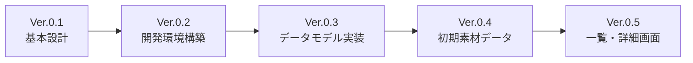
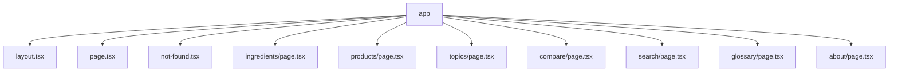
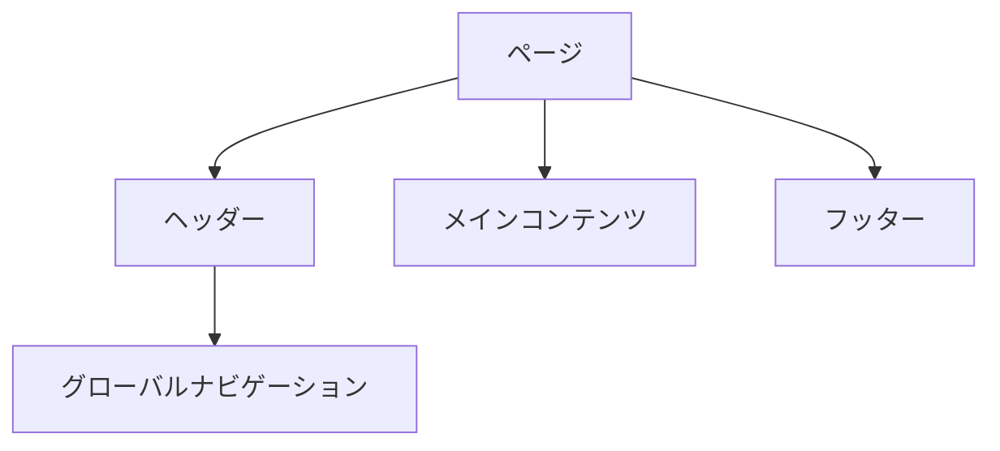
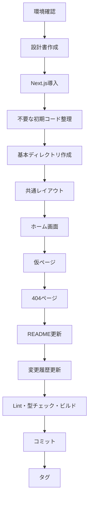

# Ver.0.2 開発環境構築設計書

## 文書情報

* バージョン：Ver.0.2
* 文書種別：実装設計書
* 作成日：2026-07-21
* 対象プロジェクト：化粧品素材から化学を学ぼう
* 作業ブランチ：`feature/environment`
* 基準バージョン：`v0.1.0`

---

# 1. 目的

Ver.0.2では、本システムの実装を開始するための基本的な開発環境を構築する。

Next.js、React、TypeScript、Tailwind CSSを用いたWebアプリケーションの土台を作成し、今後の素材データ実装、一覧画面、詳細画面、検索機能、比較機能へ進める状態を整える。

本バージョンでは、化粧品素材の本格的なデータ登録や教材コンテンツの実装は行わない。

優先する事項は、次のとおりである。

1. 正常に開発サーバーを起動できること
2. TypeScriptによる型安全な開発ができること
3. Tailwind CSSを用いて画面を構築できること
4. 基本的なページ遷移が機能すること
5. 今後の実装に適したディレクトリ構成を整えること
6. Lint、型チェック、ビルドが成功すること
7. GitでVer.0.2として再現可能な状態にすること

---

# 2. Ver.0.2の位置付け



Ver.0.2は、設計段階から実装段階へ移行する最初のバージョンである。

---

# 3. 実装対象

Ver.0.2では、次を実装する。

* Next.jsプロジェクト
* React
* TypeScript
* Tailwind CSS
* ESLint
* App Router
* 基本レイアウト
* ヘッダー
* フッター
* グローバルナビゲーション
* 仮ホーム画面
* 仮の主要ページ
* 404ページ
* 基本メタデータ
* 基本ディレクトリ構成
* npmスクリプト
* README更新
* 変更履歴更新

---

# 4. 実装対象外

Ver.0.2では、次は実装しない。

* 素材JSONデータ
* 素材データの型定義
* 素材一覧の本実装
* 素材詳細の本実装
* 化学構造式表示
* 検索機能
* 絞り込み機能
* 比較機能
* 製品データ
* 学習テーマデータ
* 用語集データ
* 参考文献データ
* データ検証スクリプト
* 単体テスト
* E2Eテスト
* データベース
* API
* 利用者認証
* 管理画面
* AI機能

仮ページは作成するが、内容は今後実装予定であることを示す簡潔な表示に留める。

---

# 5. 採用技術

| 分類      | 採用技術               |
| ------- | ------------------ |
| フレームワーク | Next.js            |
| UIライブラリ | React              |
| 言語      | TypeScript         |
| スタイル    | Tailwind CSS       |
| ルーティング  | Next.js App Router |
| パッケージ管理 | npm                |
| Lint    | ESLint             |
| バージョン管理 | Git                |
| 文書      | Markdown           |
| 図       | Mermaid            |

---

# 6. Node.js環境

実装前に、Node.jsとnpmが利用可能であることを確認する。

確認コマンド：

```bash
node --version
npm --version
```

原則として、Next.jsの作成時点でサポートされているNode.jsのLTS版を使用する。

Node.jsのバージョンは、READMEまたは環境管理ファイルへ記録する。

候補：

```text
.nvmrc
```

または

```text
.node-version
```

Ver.0.2では、少なくとも利用したNode.jsのバージョンをREADMEに記載する。

---

# 7. Next.jsプロジェクト作成方針

既存のGitリポジトリ直下へNext.jsを導入する。

既存の次のファイルとディレクトリは維持する。

```text
docs/
.git/
.gitignore
README.md
```

新しい別リポジトリや下位ディレクトリへNext.jsプロジェクトを作成しない。

プロジェクトルートは次のままとする。

```text
cosmetic-chemistry-learning/
```

---

# 8. create-next-appの設定

プロジェクト作成時は、次の設定を使用する。

| 設定               | 選択    |
| ---------------- | ----- |
| TypeScript       | Yes   |
| ESLint           | Yes   |
| Tailwind CSS     | Yes   |
| `src/` directory | No    |
| App Router       | Yes   |
| Turbopack        | Yes   |
| import alias     | `@/*` |

`src/` ディレクトリは使用せず、設計書で定めた `app`、`components`、`lib` などをリポジトリ直下へ配置する。

---

# 9. 想定ディレクトリ構成

Ver.0.2完了時の想定構成：

```text
cosmetic-chemistry-learning/
├── app/
│   ├── about/
│   │   └── page.tsx
│   ├── compare/
│   │   └── page.tsx
│   ├── glossary/
│   │   └── page.tsx
│   ├── ingredients/
│   │   └── page.tsx
│   ├── products/
│   │   └── page.tsx
│   ├── search/
│   │   └── page.tsx
│   ├── topics/
│   │   └── page.tsx
│   ├── favicon.ico
│   ├── globals.css
│   ├── layout.tsx
│   ├── not-found.tsx
│   └── page.tsx
├── components/
│   ├── layout/
│   │   ├── Footer.tsx
│   │   ├── Header.tsx
│   │   ├── MainNavigation.tsx
│   │   └── PageContainer.tsx
│   └── common/
│       └── PagePlaceholder.tsx
├── data/
│   └── .gitkeep
├── docs/
│   ├── versions/
│   │   └── Ver.0.2_開発環境構築設計書.md
│   └── ...
├── lib/
│   └── .gitkeep
├── public/
├── types/
│   └── .gitkeep
├── utils/
│   └── .gitkeep
├── .gitignore
├── eslint.config.mjs
├── next.config.ts
├── next-env.d.ts
├── package-lock.json
├── package.json
├── postcss.config.mjs
├── README.md
└── tsconfig.json
```

空ディレクトリはGitで管理されないため、必要に応じて `.gitkeep` を配置する。

---

# 10. App Router構成



---

# 11. 実装するURL

| 画面      | URL            |
| ------- | -------------- |
| ホーム     | `/`            |
| 素材一覧    | `/ingredients` |
| 製品一覧    | `/products`    |
| 学習テーマ一覧 | `/topics`      |
| 比較      | `/compare`     |
| 検索      | `/search`      |
| 用語集     | `/glossary`    |
| 教材について  | `/about`       |
| 404     | 存在しないURL       |

Ver.0.2では、素材詳細などの動的ルートはまだ作成しない。

動的ルートはVer.0.5以降で実装する。

---

# 12. 共通レイアウト

すべてのページは、次の共通構成を使用する。



基本構造：

```tsx
<body>
  <Header />
  <main>
    {children}
  </main>
  <Footer />
</body>
```

---

# 13. ヘッダー

ヘッダーには、次を表示する。

* サイト名
* ホームへのリンク
* グローバルナビゲーション
* スマートフォン向け表示への配慮

サイト名：

```text
化粧品素材から化学を学ぼう
```

初期版では、ロゴ画像は使用せず、テキストロゴとする。

---

# 14. グローバルナビゲーション

Ver.0.2で表示する項目：

```text
ホーム
素材を探す
製品から学ぶ
テーマから学ぶ
比較する
```

補助リンク：

```text
用語集
この教材について
```

デスクトップでは横並びを基本とする。

スマートフォンでは、折り返しまたは簡潔な配置とし、Ver.0.2では複雑な開閉メニューを必須としない。

---

# 15. フッター

フッターには、次を表示する。

* サイト名
* 教材の目的を示す短い説明
* 用語集へのリンク
* この教材についてへのリンク
* 著作権表記

著作権表記例：

```text
© 2026 Cosmetic Chemistry Learning Project
```

大学名や所属名を正式に表示するかは、公開方針決定後に確定する。

---

# 16. PageContainer

ページ全体の横幅、左右余白、上下余白を統一するため、`PageContainer`を作成する。

想定用途：

```tsx
<PageContainer>
  <h1>素材を探す</h1>
</PageContainer>
```

役割：

* 最大横幅の統一
* スマートフォン余白
* デスクトップ余白
* ページ間のレイアウト統一

---

# 17. ホーム画面

Ver.0.2のホーム画面では、サイトの基本コンセプトを示す。

表示要素：

1. サイトタイトル
2. 導入説明
3. 学習経路
4. 主要ページへのリンク
5. Ver.0.2では準備中であることが分かる表示

---

## 17.1 導入文案

```text
化粧品に使われる素材を入口として、
化学構造、物理化学的性質、機能、製剤中での役割を学ぶ教材です。
```

---

## 17.2 学習経路

```text
構造
↓
性質
↓
機能
↓
製剤中での役割
↓
製品
```

---

## 17.3 主要導線

ホーム画面には、次のカードまたはリンクを配置する。

* 素材から学ぶ
* 製品から学ぶ
* 化学テーマから学ぶ
* 素材を比較する

---

# 18. 仮ページ

次のページは共通の仮ページコンポーネントを使用する。

* 素材一覧
* 製品一覧
* 学習テーマ一覧
* 比較
* 検索
* 用語集
* この教材について

共通表示例：

```text
素材を探す

このページは現在準備中です。
Ver.0.5で素材一覧機能を実装する予定です。
```

ページごとに、予定している機能の概要を表示する。

---

# 19. PagePlaceholderコンポーネント

仮ページの表示を統一するため、次のようなプロパティを持つコンポーネントを作成する。

```ts
interface PagePlaceholderProps {
  title: string;
  description: string;
  plannedVersion?: string;
}
```

使用例：

```tsx
<PagePlaceholder
  title="素材を探す"
  description="化粧品素材を分類や機能から探せるページです。"
  plannedVersion="Ver.0.5"
/>
```

---

# 20. 404ページ

存在しないURLへアクセスした場合は、独自の404ページを表示する。

表示内容：

* ページが見つからないこと
* URLが誤っている可能性
* ホームへのリンク
* 素材一覧へのリンク

文案例：

```text
ページが見つかりませんでした。

URLが変更されたか、入力したURLが正しくない可能性があります。
ホームまたは素材一覧から目的のページを探してください。
```

---

# 21. メタデータ

ルートレイアウトで、基本メタデータを設定する。

タイトル：

```text
化粧品素材から化学を学ぼう
```

説明：

```text
化粧品素材を入口として、化学構造、物理化学的性質、機能、製剤中での役割を学ぶ教育用Web教材です。
```

言語：

```html
<html lang="ja">
```

---

# 22. スタイル方針

Ver.0.2では、詳細なデザインを完成させず、読みやすく一貫した基本スタイルを作る。

優先事項：

* 白背景
* 十分な余白
* 読みやすい日本語
* 明確な見出し階層
* 落ち着いた色
* スマートフォン対応
* 高すぎない情報密度

---

# 23. 色の基本方針

Ver.0.2では、次の役割を区別できる程度の色を使用する。

| 用途    | 方針           |
| ----- | ------------ |
| 背景    | 白または非常に薄い中性色 |
| 本文    | 黒に近い濃色       |
| 主見出し  | 濃い青系または紫系    |
| リンク   | 識別しやすい色      |
| カード背景 | 薄い中性色        |
| 境界線   | 薄いグレー        |

正式なブランドカラーは、画面実装を確認した後に決定する。

---

# 24. タイポグラフィ

日本語本文の読みやすさを優先する。

原則：

* OS標準の日本語サンセリフ体
* 本文の行間を十分に確保
* 見出しと本文の差を明確にする
* 極端に細いフォントを使用しない
* 長文の横幅を広くしすぎない

外部WebフォントはVer.0.2では必須としない。

---

# 25. レスポンシブ対応

最低限、次の画面幅を考慮する。

| 分類      | 想定幅      |
| ------- | -------- |
| スマートフォン | 320px以上  |
| タブレット   | 768px前後  |
| デスクトップ  | 1024px以上 |

確認対象：

* 横スクロールが発生しない
* ナビゲーションが画面外にはみ出さない
* タイトルが不自然に切れない
* カードが適切に縦並びになる
* 左右の余白が不足しない

---

# 26. アクセシビリティ

Ver.0.2で最低限対応する。

* `html`の言語を日本語に設定する
* 見出し階層を守る
* ナビゲーションに意味のある要素を使用する
* リンクとボタンを区別する
* キーボードでリンクへ移動できる
* 色だけに意味を依存しない
* 十分な文字サイズを確保する
* フォーカス表示を消さない

---

# 27. TypeScript方針

TypeScriptのstrict設定を維持する。

確認項目：

```json
{
  "compilerOptions": {
    "strict": true
  }
}
```

原則：

* `any`を安易に使用しない
* コンポーネントのpropsに型を定義する
* 将来のデータ型とUI型を混同しない
* 不要な型アサーションを避ける
* 型エラーを残したままコミットしない

---

# 28. import alias

次のエイリアスを使用する。

```text
@/*
```

使用例：

```tsx
import Header from "@/components/layout/Header";
```

相対パスが深くなりすぎることを防ぐ。

避ける例：

```tsx
import Header from "../../../components/layout/Header";
```

---

# 29. ESLint

Ver.0.2では、Next.js標準のESLint設定を使用する。

最低条件：

* `npm run lint` が成功する
* 未使用変数を残さない
* 不正なReact記述を残さない
* 型エラーとは別にLintエラーも解消する

ESLintルールの大幅な独自変更は行わない。

---

# 30. npmスクリプト

`package.json`には、少なくとも次を用意する。

```json
{
  "scripts": {
    "dev": "next dev",
    "build": "next build",
    "start": "next start",
    "lint": "eslint .",
    "typecheck": "tsc --noEmit"
  }
}
```

create-next-appの生成内容によっては、既存スクリプトを調整する。

---

# 31. 開発サーバー

開発中は、次で起動する。

```bash
npm run dev
```

ブラウザで次へアクセスする。

```text
http://localhost:3000
```

確認事項：

* ホーム画面が表示される
* ヘッダーが表示される
* フッターが表示される
* 各ナビゲーションリンクが機能する
* ターミナルに重大なエラーが出ない

---

# 32. 型チェック

次で実行する。

```bash
npm run typecheck
```

完成条件：

```text
エラーなし
```

---

# 33. Lint

次で実行する。

```bash
npm run lint
```

完成条件：

```text
エラーなし
```

警告も可能な限り解消する。

---

# 34. ビルド

次で実行する。

```bash
npm run build
```

完成条件：

* ビルドが成功する
* 主要ページが生成される
* TypeScriptエラーがない
* ESLintエラーがない
* ルート生成エラーがない
* 404ページが機能する

---

# 35. 動作確認対象ページ

次のURLをブラウザで確認する。

```text
/
 /ingredients
 /products
 /topics
 /compare
 /search
 /glossary
 /about
 /存在しないURL
```

実際には先頭に空白を入れず入力する。

---

# 36. README更新

READMEには、少なくとも次を記載する。

* プロジェクト名
* プロジェクト概要
* 現在のバージョン
* 使用技術
* 必要な環境
* セットアップ方法
* 開発サーバー起動方法
* Lint方法
* 型チェック方法
* ビルド方法
* ディレクトリ概要
* 開発方針
* 現在の実装状況

---

# 37. READMEの実行手順

例：

```bash
npm install
npm run dev
```

確認：

```text
http://localhost:3000
```

品質確認：

```bash
npm run lint
npm run typecheck
npm run build
```

---

# 38. 変更履歴更新

`docs/08_変更履歴.md`へ、Ver.0.2の内容を追加する。

記載内容：

* Next.js開発環境を構築
* TypeScriptを設定
* Tailwind CSSを設定
* App Routerを採用
* 基本ディレクトリを作成
* 共通レイアウトを作成
* 仮ホーム画面を作成
* 主要仮ページを作成
* 404ページを作成
* Lint、型チェック、ビルドを確認

---

# 39. Git管理対象

Gitへ登録する。

* Next.jsソースコード
* コンポーネント
* CSS
* 設定ファイル
* `package.json`
* `package-lock.json`
* README
* 設計書
* 変更履歴
* `.gitkeep`

Gitへ登録しない。

* `node_modules`
* `.next`
* `out`
* `.env`
* `.env.local`
* `.DS_Store`
* `._*`
* 一時ファイル
* エディタ固有の不要ファイル

---

# 40. `.gitignore`

少なくとも次を含める。

```gitignore
# dependencies
node_modules/

# next.js
.next/
out/

# production
build/

# environment
.env
.env.local
.env.development.local
.env.test.local
.env.production.local

# logs
npm-debug.log*
yarn-debug.log*
yarn-error.log*
pnpm-debug.log*

# macOS
.DS_Store
._*

# TypeScript
*.tsbuildinfo
next-env.d.ts
```

ただし、`next-env.d.ts`についてはNext.jsの推奨設定と生成された`.gitignore`を確認し、通常のNext.js構成に従う。

既存の`.gitignore`を無理に全面置換せず、重複や矛盾がないように統合する。

---

# 41. 実装順序



---

# 42. マイルストーン

## Milestone 0.2-1：環境作成

完了条件：

* Next.jsが導入されている
* npmパッケージがインストールされている
* 開発サーバーが起動する
* 初期ページが表示される

---

## Milestone 0.2-2：基本構造

完了条件：

* 想定ディレクトリが作成されている
* 共通レイアウトがある
* ヘッダーがある
* フッターがある
* ナビゲーションがある
* PageContainerがある

---

## Milestone 0.2-3：画面骨格

完了条件：

* ホーム画面がある
* 素材一覧仮ページがある
* 製品一覧仮ページがある
* 学習テーマ仮ページがある
* 比較仮ページがある
* 検索仮ページがある
* 用語集仮ページがある
* 教材について仮ページがある
* 404ページがある

---

## Milestone 0.2-4：品質確認

完了条件：

* `npm run lint` 成功
* `npm run typecheck` 成功
* `npm run build` 成功
* 主要URLの表示確認
* スマートフォン幅の表示確認
* README更新
* 変更履歴更新

---

## Milestone 0.2-5：バージョン確定

完了条件：

* Gitの差分を確認
* 不要ファイルが含まれていない
* `feature/environment`へコミット
* `main`へ統合
* `v0.2.0`タグを作成
* 作業ツリーがクリーン

---

# 43. 完成条件

Ver.0.2は、次のすべてを満たした場合に完成とする。

## 開発環境

* [ ] Node.jsとnpmのバージョンを確認した
* [ ] Next.jsプロジェクトをルートへ導入した
* [ ] TypeScriptが有効である
* [ ] Tailwind CSSが有効である
* [ ] ESLintが有効である
* [ ] App Routerを使用している
* [ ] import alias `@/*` が使用できる

## ディレクトリ

* [ ] `app`が存在する
* [ ] `components`が存在する
* [ ] `data`が存在する
* [ ] `lib`が存在する
* [ ] `types`が存在する
* [ ] `utils`が存在する
* [ ] `docs/versions`が存在する

## 共通UI

* [ ] Headerが表示される
* [ ] MainNavigationが表示される
* [ ] Footerが表示される
* [ ] PageContainerが機能する
* [ ] 全ページで共通レイアウトが使われている

## ページ

* [ ] ホーム画面が表示される
* [ ] 素材一覧仮ページが表示される
* [ ] 製品一覧仮ページが表示される
* [ ] 学習テーマ仮ページが表示される
* [ ] 比較仮ページが表示される
* [ ] 検索仮ページが表示される
* [ ] 用語集仮ページが表示される
* [ ] 教材について仮ページが表示される
* [ ] 存在しないURLで404ページが表示される

## 品質

* [ ] `npm run dev`で起動できる
* [ ] `npm run lint`が成功する
* [ ] `npm run typecheck`が成功する
* [ ] `npm run build`が成功する
* [ ] ブラウザコンソールに重大なエラーがない
* [ ] スマートフォン幅で横スクロールしない
* [ ] ナビゲーションリンクが機能する

## 文書

* [ ] READMEを更新した
* [ ] `docs/08_変更履歴.md`を更新した
* [ ] 本設計書と実装内容が一致している
* [ ] 実装上の変更点を設計書へ反映した

## Git

* [ ] 不要な`._*`ファイルが管理対象にない
* [ ] `.DS_Store`が管理対象にない
* [ ] `node_modules`が管理対象にない
* [ ] `.next`が管理対象にない
* [ ] コミットが作成されている
* [ ] `main`へ統合されている
* [ ] `v0.2.0`タグが付いている
* [ ] `git status`がクリーンである

---

# 44. コミット方針

実装量に応じて、次のように複数コミットへ分ける。

例：

```text
Add Next.js development environment
Add shared layout and navigation
Add placeholder application pages
Update README and Ver.0.2 documentation
```

小規模であれば、一つのコミットへまとめてもよい。

推奨最終コミットメッセージ：

```text
Complete Ver.0.2 development environment
```

---

# 45. ブランチ統合方針

作業ブランチ：

```text
feature/environment
```

完成後：

```bash
git switch main
git merge --no-ff feature/environment
```

マージコミット例：

```text
Merge feature/environment for Ver.0.2
```

---

# 46. タグ

Ver.0.2完成後、注釈付きタグを作成する。

```bash
git tag -a v0.2.0 -m "Complete development environment setup"
```

確認：

```bash
git log --oneline --decorate -5
git tag
```

---

# 47. ロールバック

Ver.0.2の実装に問題がある場合は、`v0.1.0`へ戻れるようにする。

確認：

```bash
git tag
```

一時的にVer.0.1を確認する場合：

```bash
git switch --detach v0.1.0
```

元のブランチへ戻る場合：

```bash
git switch feature/environment
```

通常は、作業ファイルを削除して戻すのではなく、Gitの履歴を利用する。

---

# 48. 想定される問題

## 48.1 既存ファイルとの競合

create-next-appが既存のREADMEや`.gitignore`を変更する可能性がある。

対策：

* 実行前にGitの状態を確認する
* 実行後に差分を確認する
* 既存文書を失わない
* READMEは既存内容と生成内容を統合する

---

## 48.2 外付けドライブ上の`._*`

macOSがAppleDoubleファイルを作成する可能性がある。

対策：

```gitignore
._*
```

必要に応じて削除：

```bash
find . -type f -name '._*' -delete
```

---

## 48.3 Node.jsのバージョン

Node.jsが古い場合、Next.jsが動作しない可能性がある。

対策：

* `node --version`を確認する
* 必要に応じてNode.js LTSへ変更する
* 使用バージョンをREADMEへ記録する

---

## 48.4 ポート競合

3000番ポートが使用中の場合、別ポートで起動する可能性がある。

例：

```text
http://localhost:3001
```

ターミナルに表示されたURLを使用する。

---

## 48.5 日本語ファイル名

Gitの表示で日本語ファイル名がエスケープされる可能性がある。

設定：

```bash
git config core.quotePath false
```

---

## 48.6 Tailwind CSSのバージョン差

create-next-appの時点で、Tailwind CSSの構成が設計書の想定と異なる可能性がある。

対策：

* 生成された正式な構成を優先する
* 古いバージョンの設定方法を無理に適用しない
* 実際の構成をREADMEと設計書へ反映する

---

# 49. Ver.0.3への引き継ぎ

Ver.0.2完了後は、次をVer.0.3で実装する。

* TypeScriptデータ型
* 素材分類型
* Ingredient型
* Property型
* Function型
* Product型
* LearningTopic型
* Reference型
* Relation型
* JSONデータ配置方針
* データ取得関数
* IDとスラッグの管理
* データ検証方法
* サンプル素材データ

Ver.0.2では、これらを実装しやすいディレクトリと基本構成を準備する。

---

# 50. 実装開始前チェック

実装開始前に次を確認する。

```bash
git branch --show-current
git status
node --version
npm --version
```

期待する状態：

```text
現在のブランチ：
feature/environment

Git：
未コミットの予期しない変更がない

Node.js：
Next.jsが対応するバージョン

npm：
正常に実行可能
```

---

# 51. 更新方針

次の場合に本設計書を更新する。

* create-next-appの構成が想定と異なった場合
* 採用するNode.jsバージョンを決定した場合
* Tailwind CSSの設定方式が変わった場合
* ディレクトリ構成を変更した場合
* ページ構成を変更した場合
* npmスクリプトを変更した場合
* 完成条件を変更した場合
* 実装中に新たな技術判断を行った場合

重要な変更は、`docs/08_変更履歴.md`にも記録する。
